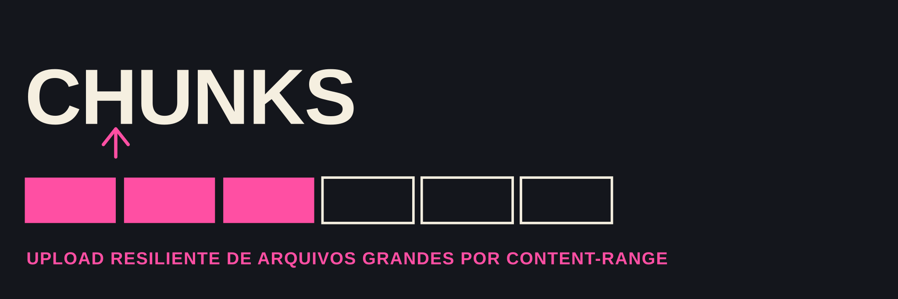

<h4 align="center">Upload de arquivos grandes em chunks, no navegador, com <a href="https://developer.mozilla.org/en-US/docs/Web/API/Fetch_API" target="_blank">fetch</a>.</h4>

<p align="center">
  <a href="https://github.com/matheusgb/chunks/actions/workflows/ci.yml">
    
  </a>
  <a href="./LICENSE">
    
  </a>
</p>

## O que é

Um snippet client-side (sem dependências, sem build) que fatia um arquivo em
pedaços de tamanho fixo e envia cada pedaço em uma requisição `POST`
separada, usando o header `Content-Range` para o servidor saber onde aquele
pedaço entra no arquivo final. Existe pra ser copiado e adaptado, não é um
pacote publicado.

**Este repositório é só o cliente.** Não há servidor aqui: `chunked-upload.js`
funciona contra qualquer backend que aceite chunks nesse formato (Google
Drive resumable upload, tus, ou um endpoint próprio).

## Arquivos

| Arquivo | O que é |
| --- | --- |
| `chunked-upload.js` | a lógica de fatiamento e envio, sem tocar no DOM |
| `chunked-upload.test.js` | testes da lógica de fatiamento (`node --test`, sem mocks de rede) |
| `app.js` | exemplo de integração: liga o input de arquivo a uma barra de progresso |
| `index.html` | página mínima pra rodar o exemplo |

## Contrato HTTP

Cada chunk é enviado como `multipart/form-data` (campo `file`) com:

```
Content-Range: bytes {início}-{fim}/{tamanho total}
Authorization: Bearer {token}   (se um token for configurado)
```

Qualquer resposta fora da faixa 2xx interrompe o upload. O tamanho do chunk é
configurável (10 MiB por padrão).

## Como usar

```html
<script src="chunked-upload.js"></script>
<script>
  await uploadFileInChunks(file, {
    url: "https://sua-api/upload",
    token: "seu-token",
    onProgress: (fraction) => console.log(`${Math.round(fraction * 100)}%`),
  });
</script>
```

Para ver o exemplo completo, preencha `UPLOAD_URL` em `app.js` e abra
`index.html` servido por qualquer servidor estático.

## Testes

```
npm test
```
